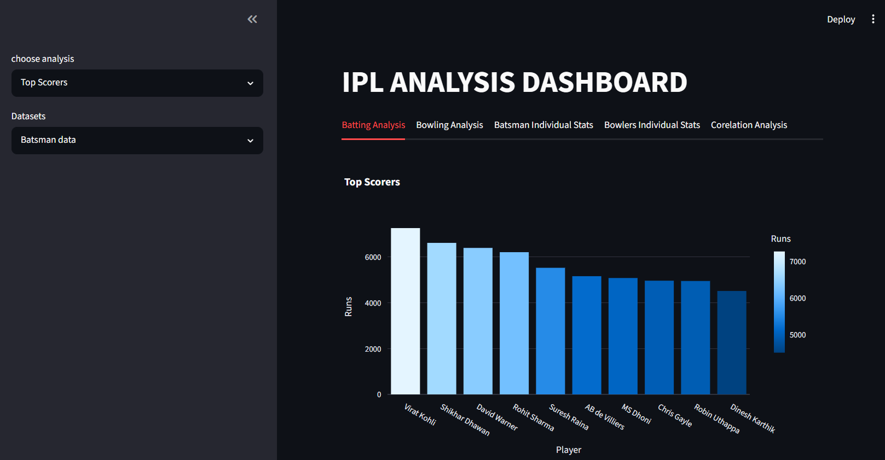

IPL Analysis Dashboard

An interactive IPL (Indian Premier League) Data Analysis Dashboard built using **Python**, **Pandas**, **Plotly**, and **Streamlit**. This project provides comprehensive batting and bowling statistics, player comparisons, correlation analysis, KPI cards, and downloadable PDF reports through an interactive web interface.

Project Overview

The IPL Analysis Dashboard helps users explore and analyze IPL player statistics using interactive visualizations and data-driven insights. It allows users to compare players, identify top performers, analyze relationships between different performance metrics, and generate reports.

Features

Dashboard Overview
- Interactive Streamlit dashboard
- KPI cards for key batting and bowling statistics
- Responsive layout with multiple tabs

Batting Analysis
- Top Run Scorers
- Highest Batting Average
- Highest Strike Rate
- Most Fours
- Most Sixes
- Interactive charts and graphs

Bowling Analysis
- Most Wickets
- Best Economy Rate
- Best Bowling Average
- Best Bowling Figures (BBI)
- Bowling Strike Rate
- Interactive visualizations

Player Analysis
- Individual player statistics
- Detailed batting performance
- Detailed bowling performance
- Career summary

Player Comparison
- Compare batting statistics between players
- Compare bowling statistics between players
- Side-by-side visual comparison

Correlation Analysis
- Compare any two numerical statistics
- Correlation Heatmap
- Scatter Plot
- Correlation Coefficient

Report Generation
- Generate downloadable PDF reports
- Summary of important statistics

Technologies Used

- Python
- Pandas
- NumPy
- Plotly
- Matplotlib
- Streamlit
- ReportLab

Project Structure

IPL Analysis Project/
│
├── dashboard/
│   └── app.py
│
├── src/
│   ├── analysis.py
│   └── report.py
│
├── datasets/
│   ├── batting.csv
│   └── bowling.csv
│
├── requirements.txt
├── README.md
└── .gitignore

Installation

Clone the repository

git clone https://github.com/your-username/IPL-Analysis-Project.git

Navigate into the project

cd IPL-Analysis-Project

Install dependencies

pip install -r requirements.txt

Run the application

streamlit run dashboard/app.py

Dashboard Screenshots

Batting Analysis

[Batting Analysis](screenshots/batting%20alaysis.png)

Bowling Analysis

[Bowling Analysis](screenshots/bowling%20analysis.png)

Player Comparison

[Player Comparision](screenshots/player%20comparision.png)

Correlation Analysis

[correlation Analysis](screenshotscorrelation%20analysis.png)

Skills Demonstrated

- Data Cleaning
- Exploratory Data Analysis (EDA)
- Data Visualization
- Dashboard Development
- Interactive Web Applications
- Python Programming
- Pandas Data Analysis
- Plotly Visualizations
- Streamlit Development
- Report Generation
- Git & GitHub

Future Improvements

- Machine Learning Player Performance Prediction
- Match Winner Prediction
- Player Recommendation System
- Team-wise Analysis
- Season-wise Analysis
- Live IPL Data Integration
- Advanced Statistical Analysis
- SQL Database Integration
- User Authentication
- Dashboard Deployment on Streamlit Cloud

Author

**Shashank Tujala**

GitHub: https://github.com/your-username
